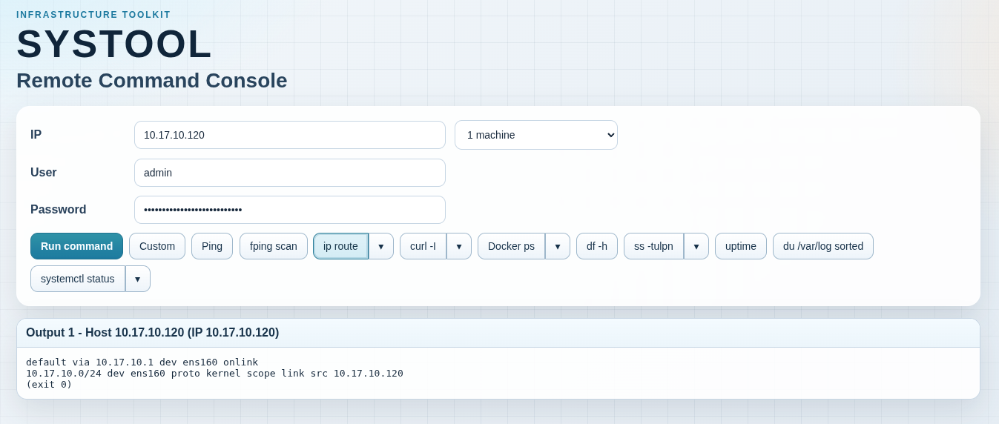
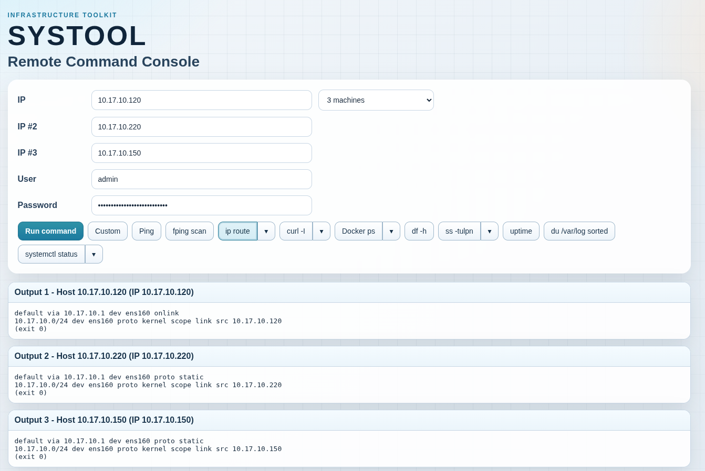
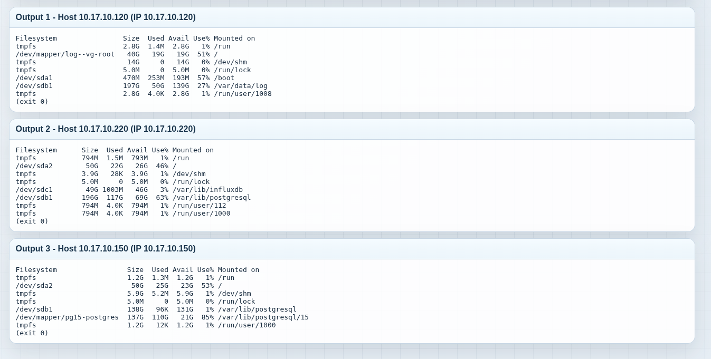

# SYSTOOL

SYSTOOL is a lightweight web console for running remote Linux commands over SSH on one or many machines at the same time.

It is designed for quick infrastructure checks: networking, Docker, systemd services, storage diagnostics, and custom shell commands.

## Features

- Run commands on `1-10` hosts in one request
- Use `IP` or DNS hostnames (resolved to IPv4 before SSH)
- Fast action presets (`ping`, `ip route`, `curl`, `docker`, `ss`, `df -h`, `uptime`, `systemctl`)
- Split-button command variants (for example `ip route` / `ip route get`)
- Per-host output cards for multi-machine execution
- Simple web UI, no client build step

## Requirements

- Python 3.10+
- Access to target machines over SSH
- `paramiko` installed in your environment

## Quick Start

### Option A: Local run (recommended for development)

```bash
python3 -m venv venv
source venv/bin/activate
pip install docker/reqruiemnts.txt
uvicorn main:app --reload --host 0.0.0.0 --port 6767
```

Open:

- `http://localhost:6767`

### Option B: Using setup script + Docker

```bash
chmod +x setup.sh
./setup.sh
```

This script builds the image and runs Docker Compose.

Open:

- `http://localhost:6767`

## Docker

`docker-compose.yml` exposes:

- Host `6767` -> Container `8000`

So the app is available at:

- `http://localhost:6767`

## How To Use

1. Enter one host in `IP` (or choose multiple machines and fill `IP #2`, `IP #3`, ...).
2. Enter SSH `User` and `Password`.
3. Pick an action button (or `Custom`).
4. Click `Run command`.
5. Read output per host in the result cards.

## Screenshots

> Add your screenshots to `docs/screenshots/` with the filenames below.

### Single host route output



### Multi-host output



### Multi-host df output



## Development

Run with autoreload:

```bash
uvicorn main:app --reload --host 0.0.0.0 --port 6767
```
